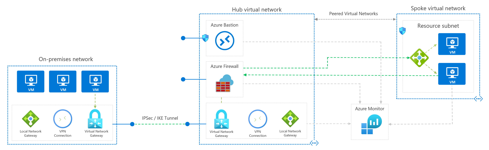
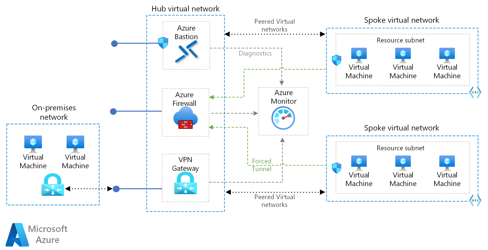
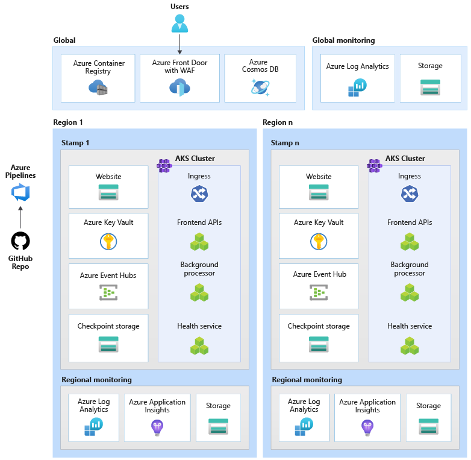

# BLUEPRINTS

## NETWORKING Blueprints

### Extend an on-premises network into a secure, hybrid network in Azure
[Implement a secure hybrid network blueprint](https://docs.microsoft.com/en-us/azure/architecture/reference-architectures/dmz/secure-vnet-dmz?tabs=portal#architecture)

### Security Benchmark Foundation

[Security Benchmark Foundation blueprint](https://docs.microsoft.com/en-us/azure/governance/blueprints/samples/azure-security-benchmark-foundation)

>Note
>
> The Azure Security Benchmark Foundation lays out a foundational architecture for workloads. The architecture diagram above includes several notional resources to demonstrate potential use of subnets. You still need to deploy workloads on this foundational architecture.

### Hub-spoke network topology

[Hub and Spoke blueprint](https://docs.microsoft.com/en-us/azure/architecture/reference-architectures/hybrid-networking/hub-spoke)

### Mission-critical workload (AKS)
[Mission-critical workload architecture on Azure (AKS) blueprint](https://docs.microsoft.com/en-us/azure/architecture/reference-architectures/containers/aks-mission-critical/mission-critical-intro)

[Mission-critical workload architecture](https://docs.microsoft.com/en-us/azure/architecture/reference-architectures/containers/aks-mission-critical/mission-critical-intro)

### Azure Kubernetes Service behind Azure Firewall
[Blueprint - Use Azure Firewall to help protect an Azure Kubernetes Service (AKS) cluster](https://docs.microsoft.com/en-us/azure/architecture/example-scenario/aks-firewall/aks-firewall)

### Extend an on-premises network using ExpressRoute
[Blueprint](https://docs.microsoft.com/en-us/azure/architecture/reference-architectures/hybrid-networking/expressroute)

### Connect an on-premises network to Azure using ExpressRoute
[blueprint](https://docs.microsoft.com/en-us/azure/architecture/reference-architectures/hybrid-networking/expressroute-vpn-failover)

### Azure Landing Zone Accelerator vs. Blueprints

where organizations have specific business or technical requirements

### Landing Zone Network Design Foundations:

- Hybrid integration for connectivity between on-premises, multicloud, edge, and global users. For more information, see Enterprise-scale support for hybrid and multicloud.

- Performance and reliability at scale for workload scalability and consistent, low-latency experience.

- Zero-trust-based network security for network perimeter and traffic flow security. For more information, see Network security strategies on Azure.

- Extensibility for easy expansion of network footprints without any need for design reworks.

### Azure Networking components and concepts

- **Azure Virtual Network**
is the fundamental building block for private networks in Azure. Many types of Azure resources, including Azure Virtual Machines (VMs), can securely communicate with each other, the internet, and on-premises datacenters by using Azure Virtual Network. A virtual network is similar to a traditional network you operate out of your own datacenter, but has the Azure infrastructure benefits of scale, availability, and isolation.

- **Network virtual appliances (NVAs)**
is a network device that supports functions like connectivity, application delivery, wide-area network (WAN) optimization, and security. NVAs include Azure Firewall and Azure Load Balancer.

- **Azure Virtual WAN**
is a networking service that brings multiple networking, security, and routing functions together within a single operational interface. Functions include:

    - Branch connectivity automation from Virtual WAN partner devices such as SD-WAN or customer premises equipment (CPE) based virtual private networks (VPNs)
    - Site-to-Site VPN connectivity
    - Remote user Point-to-Site VPN connectivity
    - Private Azure ExpressRoute connectivity
    - Intracloud connectivity like transitive connectivity for virtual networks
    - VPN ExpressRoute interconnectivity
    - Routing
    - Azure Firewall
    - Encryption for private connectivity

- **Hub-spoke network topology**
involves a hub virtual network acting as a central point of connectivity for many spoke virtual networks. Your hub can also be the connectivity point for on-premises datacenter access. All spoke virtual networks peer with your hub, and you can use them to isolate workloads.

- **VXLAN (virtual extension LAN)**
is a network virtualization technology for scaling cloud networks. VXLAN generates a virtual network to overlap a local area network (LAN) by using Layer 3 (L3) technology to extend the network.

